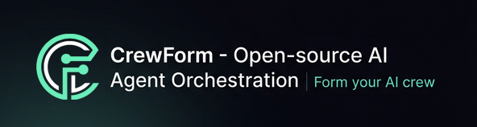

<div align="center">



### Form your AI crew

**AI Orchestration for Everyone**

[](https://www.gnu.org/licenses/agpl-3.0)
[](https://github.com/vincentgrobler/crewform/actions/workflows/ci.yml)
[](https://discord.gg/NpcWr9d7)

[Website](https://crewform.tech) · [Docs](https://docs.crewform.tech) · [Discord](https://discord.gg/NpcWr9d7) · [Twitter](https://twitter.com/CrewForm)

</div>

---

## Table of Contents

- [Why CrewForm?](#why-crewform)
- [Key Features](#key-features)
- [Quick Start](#quick-start)
- [Documentation](#documentation)
- [Architecture](#architecture)
- [Tech Stack](#tech-stack)
- [How CrewForm Compares](#how-crewform-compares)
- [Contributing](#contributing)
- [Community](#community)
- [FAQ](#faq)
- [License](#license)

## Why CrewForm?

Most multi-agent AI platforms today require you to either:

- 💸 Pay a SaaS provider who marks up your LLM costs
- 🔒 Accept vendor lock-in with no self-hosting option
- 🎓 Be a Python expert to set up orchestration from scratch

**CrewForm changes that.** We provide the orchestration layer — the UI, the team management, the monitoring, the marketplace — while you keep full control of your API keys, your data, and your infrastructure.

CrewForm is built for developers and teams who want production-ready AI agent orchestration without the complexity, cost, or lock-in of closed platforms.

## Key Features

- 🤖 **Agent Management** — Create, configure, and monitor AI agents from a visual UI
- 👥 **Team Modes** — Orchestrate agents using Pipeline, Orchestrator, or Collaboration patterns
- 🔑 **BYOK (Bring Your Own Key)** — Pay your LLM provider directly. Zero markup, zero middleman
- 🏪 **Marketplace** — Share and discover agent templates built by the community
- 🏠 **Self-Hostable** — Run on your own infrastructure with Docker Compose
- 🔒 **Secure by Default** — AES-256-GCM key encryption, Row-Level Security, GDPR-ready
- ⚡ **Real-Time** — Watch your agents work in real-time with live task execution updates
- 📊 **Usage Tracking** — Monitor token usage, costs, and performance per agent and task

## Quick Start

Get up and running in under 5 minutes:

```bash
# Clone the repo
git clone https://github.com/vincentgrobler/crewform.git
cd crewform

# Install dependencies
npm install

# Set up environment
cp .env.example .env.local

# Start development server
npm run dev
```

> **Self-hosting?** See the [Docker deployment guide](docs/self-hosting.md) for production setup.

## Documentation

| Guide | Description |
|-------|-------------|
| [Quick Start](docs/quickstart.md) | Get running in under 5 minutes |
| [Agents Guide](docs/agents.md) | Models, system prompts, and agent lifecycle |
| [Pipeline Teams](docs/pipeline-teams.md) | Multi-agent workflows and handoffs |
| [API Reference](docs/api-reference.md) | REST API endpoints and authentication |
| [Self-Hosting](docs/self-hosting.md) | Docker Compose production deployment |

## Architecture

```
┌─────────────────────────────────────────────────┐
│                   CrewForm UI                    │
│          React + TypeScript + Tailwind           │
├─────────────────────────────────────────────────┤
│                  Supabase Layer                  │
│     Auth · Database · Realtime · Storage         │
├─────────────────────────────────────────────────┤
│                  Task Runner                     │
│      Node.js · Multi-Provider LLM Support        │
│     (Anthropic · Google · OpenAI · More)         │
├─────────────────────────────────────────────────┤
│              Your LLM Providers                  │
│           (BYOK — Your Keys, Your Cost)          │
└─────────────────────────────────────────────────┘
```

## Tech Stack

| Layer | Technology |
|-------|-----------|
| **Frontend** | React 18 · TypeScript · Vite · Tailwind CSS · ShadCN UI |
| **State** | TanStack Query · Zustand |
| **Backend** | Supabase (Auth, Database, Realtime, Edge Functions) |
| **Task Runner** | Node.js · Multi-provider LLM integration |
| **Validation** | Zod |
| **Deployment** | Vercel · Docker |

## How CrewForm Compares

CrewForm occupies a unique position: a **UI-first, self-hostable, open-source** multi-agent orchestration platform with zero LLM cost markup.

| Feature | CrewForm | crewAI | AutoGen | LangGraph |
|---------|----------|--------|---------|-----------|
| Open Source | ✅ AGPL v3 | ✅ MIT | ✅ CC-BY-4.0 | ✅ MIT |
| Visual UI | ✅ Built-in | ❌ CLI/code only | ❌ Code only | ❌ Code only |
| Self-Hostable | ✅ Docker | N/A (library) | N/A (library) | N/A (library) |
| BYOK (No Markup) | ✅ | ✅ | ✅ | ✅ |
| Agent Marketplace | ✅ | ❌ | ❌ | ❌ |
| Team Collaboration | ✅ | ❌ | ❌ | ❌ |
| Multi-Provider | ✅ | ✅ | ✅ | ✅ |
| Language | TypeScript | Python | Python | Python |

> **Note:** crewAI, AutoGen, and LangGraph are excellent Python libraries for building agent systems in code. CrewForm is a full-stack platform that wraps similar orchestration capabilities in a deployable application with a UI, team features, and marketplace. They're complementary, not competitors — you could even use crewAI agents inside a CrewForm workflow.

## Contributing

We welcome contributions from everyone! Please see [CONTRIBUTING.md](CONTRIBUTING.md) for:

- 🐛 How to report bugs
- 💡 How to suggest features
- 🔧 Development setup guide
- 📋 Coding standards

## Community

- 💬 **[Discord](https://discord.gg/NpcWr9d7)** — Chat with the team and community
- 🗣️ **[GitHub Discussions](https://github.com/vincentgrobler/crewform/discussions)** — Ideas, Q&A, and show & tell
- 🐦 **[Twitter/X](https://twitter.com/CrewForm)** — Product updates and AI ecosystem commentary
- 📧 **Email** — support@crewform.tech

## FAQ

<details>
<summary><strong>What is CrewForm?</strong></summary>

CrewForm is an open-source AI orchestration platform that lets you deploy, manage, and collaborate on multi-agent AI workflows through a visual UI — without vendor lock-in or LLM cost markup.
</details>

<details>
<summary><strong>Is CrewForm free to use?</strong></summary>

Yes. CrewForm is open-source under the AGPL v3 license. You can self-host it for free. We also offer a hosted version with a free tier at [crewform.tech](https://crewform.tech).
</details>

<details>
<summary><strong>What does BYOK mean?</strong></summary>

BYOK stands for **Bring Your Own Key**. You connect your own API keys from providers like Anthropic, Google, or OpenAI. CrewForm never touches your LLM spend — you pay your provider directly at their standard rates.
</details>

<details>
<summary><strong>How is CrewForm different from crewAI?</strong></summary>

crewAI is a Python library for orchestrating AI agents in code. CrewForm is a full-stack platform with a visual UI, team collaboration, agent marketplace, and self-hosting support. They solve different problems — crewAI is for developers who want a Python framework, CrewForm is for teams who want a deployable application.
</details>

<details>
<summary><strong>Can I self-host CrewForm?</strong></summary>

Yes! CrewForm supports Docker-based self-hosting. See our [self-hosting guide](https://docs.crewform.tech/self-hosting) for instructions.
</details>

<details>
<summary><strong>What LLM providers are supported?</strong></summary>

CrewForm currently supports **Anthropic (Claude)**, **Google (Gemini)**, and **OpenAI (GPT)**. More providers are on the roadmap.
</details>

## License

CrewForm is licensed under the [GNU Affero General Public License v3.0](LICENSE).

This means you can use, modify, and distribute CrewForm freely. If you modify CrewForm and run it as a network service, you must make your modifications available under the same license.

---

<div align="center">

**CrewForm** — Form your AI crew ⚡

[Website](https://crewform.tech) · [Docs](https://docs.crewform.tech) · [Discord](https://discord.gg/NpcWr9d7) · [Twitter](https://twitter.com/CrewForm)

</div>
