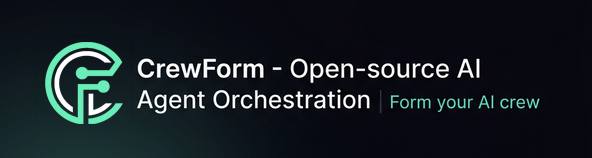
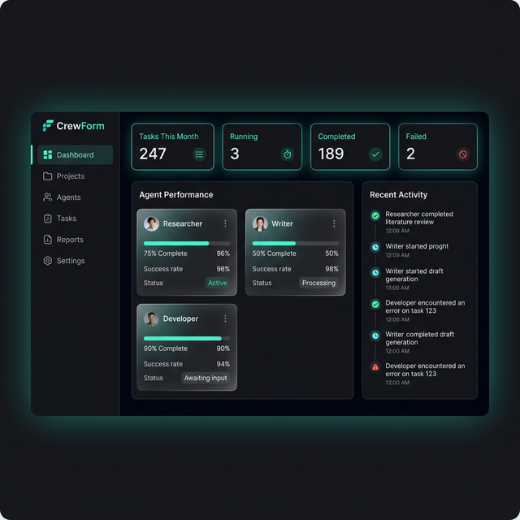
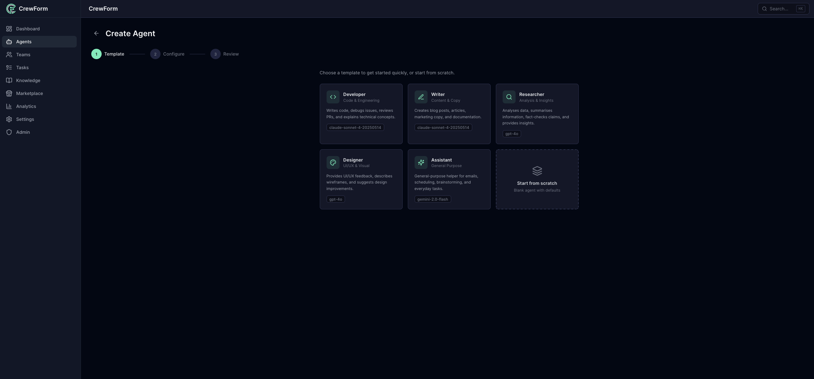
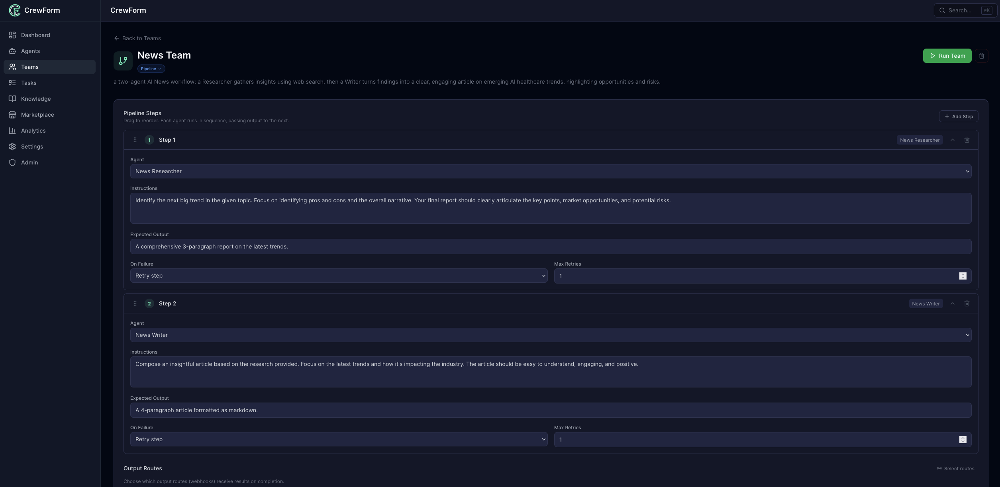
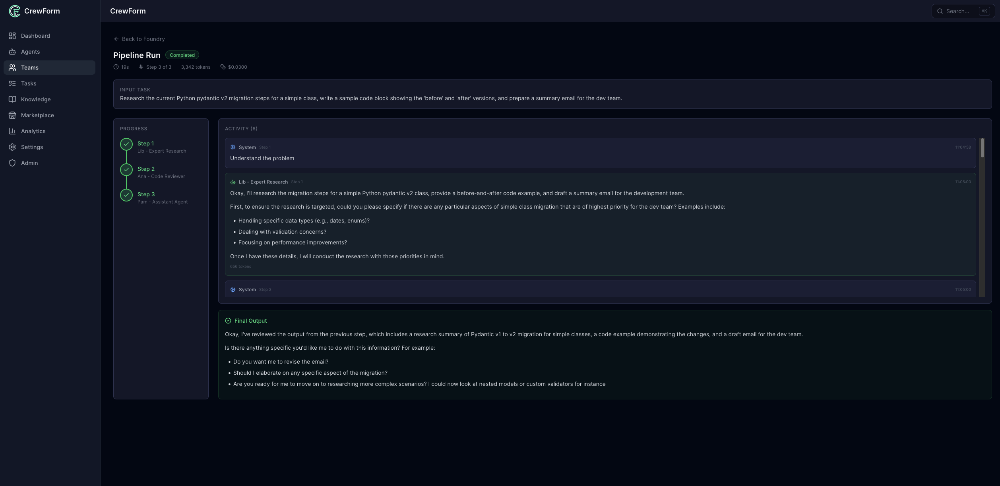
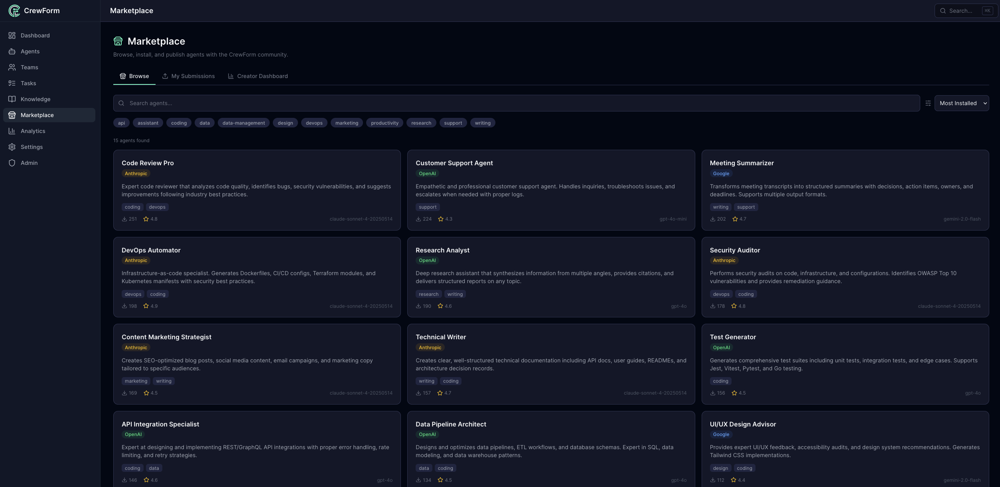
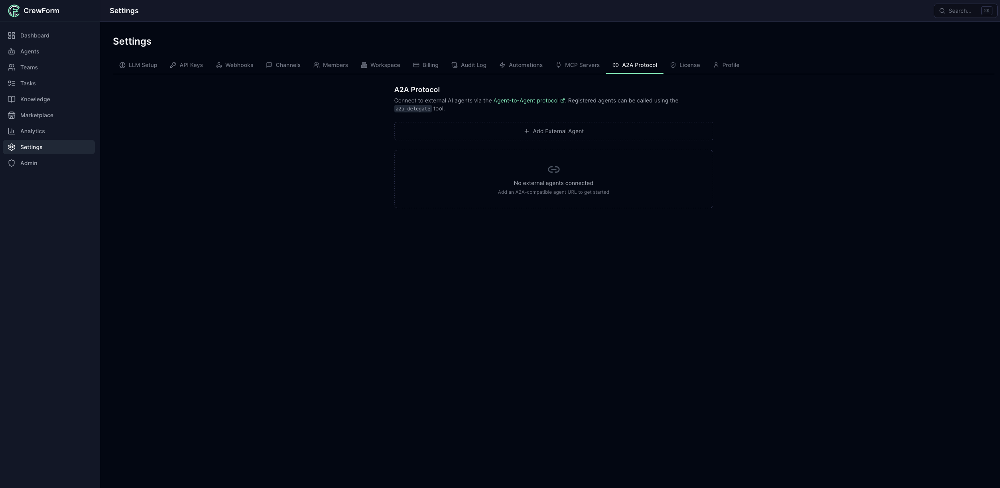
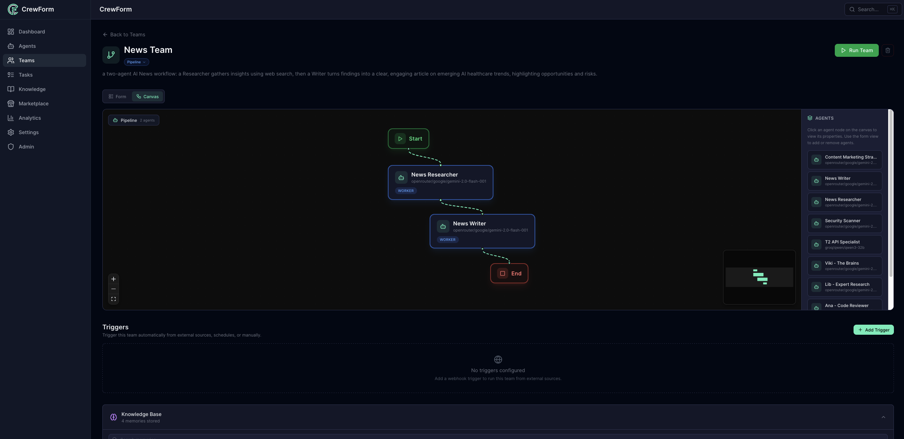
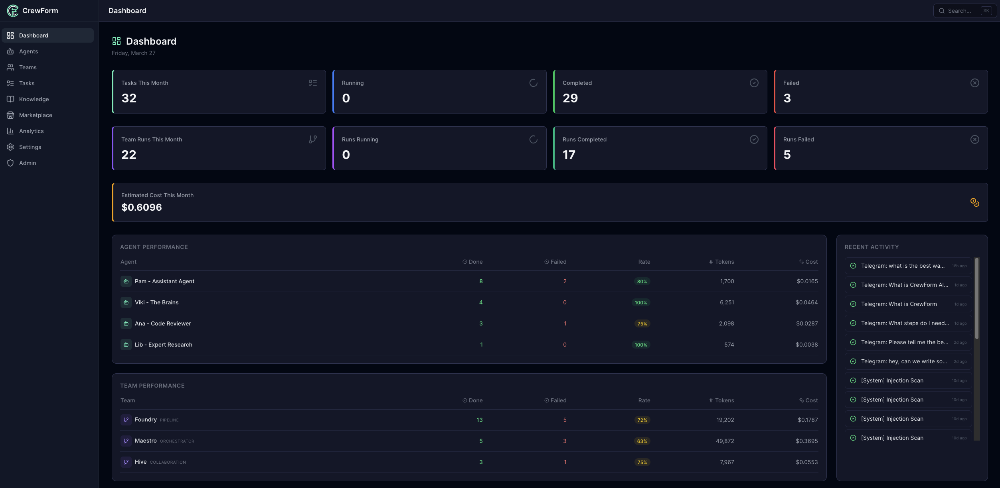
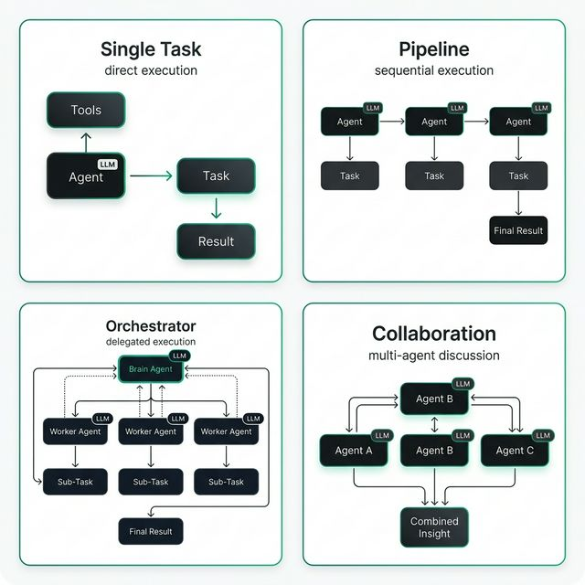

<div align="center">



### Form your AI crew

**Open-source AI Agent Orchestration Platform**

[](https://www.gnu.org/licenses/agpl-3.0)
[](https://github.com/CrewForm/crewform/actions/workflows/ci.yml)
[](https://github.com/CrewForm/crewform/stargazers)
[](https://discord.gg/TAFasJCTWs)
[](https://supabase.com)
[](https://vercel.com)
[](https://docs.crewform.tech)
[](https://zapier.com)

[Website](https://crewform.tech) · [Docs](https://docs.crewform.tech) · [Discord](https://discord.gg/TAFasJCTWs) · [Twitter](https://twitter.com/CrewFormHQ)

</div>

---

<div align="center">
  <strong>If you find CrewForm useful, please consider giving it a ⭐ — it helps others discover the project!</strong>
</div>

---

<div align="center">
  
  <p><em>The CrewForm dashboard — manage agents, track tasks, monitor performance, all in one place.</em></p>
</div>

<details>
<summary><strong>📸 More Screenshots</strong></summary>
<br/>
<table>
<tr>
<td align="center" width="50%">

<br/><em>Create agents with models, prompts, and tools</em>
</td>
<td align="center" width="50%">

<br/><em>Chain agents into pipeline teams</em>
</td>
</tr>
<tr>
<td align="center" width="50%">

<br/><em>Watch pipeline runs execute in real-time</em>
</td>
<td align="center" width="50%">

<br/><em>Browse and install community agent templates</em>
</td>
</tr>
<tr>
<td align="center" width="50%">

<br/><em>Connect to external A2A agents</em>
</td>
</tr>
<tr>
<td align="center" width="50%">

<br/><em>Visual workflow builder for pipeline teams</em>
</td>
<td align="center" width="50%">

<br/><em>Track token usage, costs, and performance</em>
</td>
</tr>
</table>
</details>

## ✨ Features at a Glance

<table>
<tr>
<td align="center" width="25%">
🤖<br/><strong>15 LLM Providers</strong><br/>OpenAI, Anthropic, Gemini, Groq, Ollama, and more
</td>
<td align="center" width="25%">
🔀<br/><strong>3 Team Modes</strong><br/>Pipeline, Orchestrator, and Collaboration
</td>
<td align="center" width="25%">
🏪<br/><strong>Agent Marketplace</strong><br/>Browse, install, and publish agent templates
</td>
<td align="center" width="25%">
🔑<br/><strong>BYOK</strong><br/>Your API keys, your cost — zero markup
</td>
</tr>
<tr>
<td align="center" width="25%">
🏠<br/><strong>Self-Hostable</strong><br/>Docker Compose — your data, your infra
</td>
<td align="center" width="25%">
🔌<br/><strong>MCP Protocol</strong><br/>Connect to thousands of MCP tool servers
</td>
<td align="center" width="25%">
📚<br/><strong>Knowledge Base (RAG)</strong><br/>Upload docs, chunk, embed, and search
</td>
<td align="center" width="25%">
🧠<br/><strong>Team Memory</strong><br/>pgvector semantic search across runs
</td>
</tr>
<tr>
<td align="center" width="25%">
🤝<br/><strong>A2A Protocol</strong><br/>Agent-to-Agent interop with external AI systems
</td>
<td align="center" width="25%">
🖥️<br/><strong>AG-UI Protocol</strong><br/>Real-time SSE streaming for frontend integration
</td>
<td align="center" width="25%">
⚡<br/><strong>Zapier + Channels</strong><br/>7,000+ apps, Discord, Slack, Telegram, Email
</td>
<td align="center" width="25%">
📊<br/><strong>Analytics</strong><br/>Track tokens, costs, and agent performance
</td>
</tr>
<tr>
<td align="center" width="25%">
🎨<br/><strong>Visual Workflow Canvas</strong><br/>Drag-and-drop agent orchestration with React Flow
</td>
<td align="center" width="25%">
🔄<br/><strong>Fallback Models</strong><br/>Auto-switch to backup models on failure
</td>
<td align="center" width="25%">
🐳<br/><strong>Local AI via Ollama</strong><br/>Air-gapped setup — zero data leaving your network
</td>
<td align="center" width="25%">
🛡️<br/><strong>RBAC & Workspaces</strong><br/>Role-based access, multi-tenant isolation
</td>
</tr>
</table>

## 🚀 Quick Start

### Hosted (Fastest)

Sign up at [crewform.tech](https://crewform.tech) — free tier includes 3 agents and 50 tasks/month.

### Self-Hosted (Docker)

```bash
git clone https://github.com/CrewForm/crewform.git
cd crewform
cp .env.example .env  # Edit with your config
docker compose up -d
```

Open **http://localhost:3000** — done!

⚡ **Local Models:** Install [Ollama](https://ollama.com) alongside CrewForm for fully local AI — zero API keys, zero data leaving your network. Run `ollama pull llama3.3` and select Ollama as a provider in Settings.

### Development

```bash
git clone https://github.com/CrewForm/crewform.git
cd crewform
npm install
cp .env.example .env.local
npm run dev
```

> 📖 See the [Self-Hosting Guide](https://docs.crewform.tech/self-hosting) for production deployment details.

## Table of Contents

- [Why CrewForm?](#why-crewform)
- [How It Works](#how-it-works)
- [Who It's For](#who-its-for)
- [Key Features](#key-features)
- [Editions & Pricing](#editions--pricing)
- [Documentation](#documentation)
- [Architecture](#architecture)
- [Tech Stack](#tech-stack)
- [Contributing](#contributing)
- [Community](#community)
- [FAQ](#faq)
- [License](#license)

## Why CrewForm?

CrewForm gives you everything you need to orchestrate multi-agent AI workflows — a visual UI, team management, real-time monitoring, and an agent marketplace — while you keep full control of your API keys, your data, and your infrastructure.

- 🖥️ **UI-First** — Create, configure, and monitor agents from a visual interface. No code required to get started
- 🔑 **BYOK (Bring Your Own Key)** — Connect your own LLM provider keys. Pay your provider directly at their standard rates, zero markup
- 🏠 **Self-Hostable** — Deploy on your own infrastructure with Docker. Your data stays with you
- 🔀 **3 Orchestration Modes** — Pipeline (sequential), Orchestrator (brain + workers), and Collaboration (multi-agent discussion)
- 🔌 **MCP Protocol** — Connect agents to thousands of external tool servers via the Model Context Protocol
- 🤝 **A2A Protocol** — Agent-to-Agent interoperability — expose agents to external AI systems and delegate tasks to remote agents
- 🖥️ **AG-UI Protocol** — Real-time SSE event streaming for frontend integration — the standard for agent-to-UI communication
- 📚 **Knowledge Base (RAG)** — Upload docs (TXT, MD, CSV, JSON), auto-chunk and embed with pgvector, then search via agents
- 🏪 **Agent Marketplace** — Browse and install community-built agent templates, or publish your own
- ⚡ **Integrations Ecosystem** — Zapier (7,000+ apps), Discord, Slack, Telegram, Email, webhooks, and output routes
- 🔒 **Secure by Default** — AES-256-GCM key encryption, Row-Level Security, GDPR-ready
- 📊 **Built-in Analytics** — Track token usage, costs, and performance per agent and task

CrewForm is the **first platform with all three agentic protocols** — MCP (tools) + A2A (agents) + AG-UI (frontend). Built for developers and teams who want production-ready AI agent orchestration.

## How It Works

CrewForm supports 4 execution modes — choose the right one for your workflow:

<p align="center">
  
</p>

| Mode | Description |
|------|-------------|
| **Single Task** | Send a prompt to one agent — it uses its LLM and tools, then returns the result. The simplest way to get work done. |
| **Pipeline** | Chain multiple agents in sequence. Each agent completes its task and passes the output to the next. Great for research → write → review workflows. |
| **Orchestrator** | A brain agent breaks down the task, delegates sub-tasks to worker agents, reviews their outputs, and assembles the final result. |
| **Collaboration** | Multiple agents discuss the task in a shared thread, debate approaches, and converge on a consensus result. |

## Who It's For

### 🧑 Solo User — Freelancer / Indie Hacker

Pick agents from the marketplace (or build your own) and throw tasks at them — "Research competitors for X", "Write a blog post about Y", "Review this code". Agents work in the background; you get results.

**Daily loop:** Dispatch tasks → review results → ship to clients.

### 👥 Small Team — Agency / Startup

Set up a shared workspace with a crew of agents matching your workflow — a Researcher, a Coder, a Writer, a QA agent. Tasks get assigned, agents run in pipeline or collaboration mode, results land in one place.

**Daily loop:** Create task → assign to agent → agent does the legwork → human reviews → done.

### 🏢 Enterprise — Agency / Multi-Tenant

Each client gets their own workspace. Custom agents built around their tools and data. Analytics show which agents perform, which cost most, where to optimise. BYOK means you control API spend.

---

> **The core habit CrewForm builds:** I have a task → I assign it to an agent → I review the output. It becomes as natural as assigning work in Slack — the difference is the agent actually does the work.

**Where it really shines:**
- Repetitive but complex tasks (reports, summaries, code reviews)
- Multi-step workflows with handoffs between skills (research → write → format)
- Teams that want AI leverage without every member needing prompt engineering skills

## Key Features

### Community Edition (Free & Open Source)

- 🔑 **BYOK (Bring Your Own Key)** — Pay your LLM provider directly. Zero markup, zero middleman
- 🤖 **Agent Management** — Create, configure, and monitor AI agents from a visual UI
- 🏪 **Marketplace** — Browse and install agent templates built by the community
- 👥 **Pipeline Mode** — Chain agents together in sequential workflows
- ✅ **Single Tasks** — Send a prompt to any agent and get results in real-time
- 🔌 **MCP Protocol** — Connect agents to external MCP tool servers for dynamic tool discovery
- 📚 **Knowledge Base (RAG)** — Upload documents, auto-chunk and embed, and search via agents
- 🏠 **Self-Hostable** — Run on your own infrastructure with Docker Compose
- 🔒 **Secure by Default** — AES-256-GCM key encryption, Row-Level Security, GDPR-ready
- ⚡ **Real-Time** — Watch your agents work in real-time with live task execution updates
- 🎨 **Visual Workflow Canvas** — Drag-and-drop agents onto an interactive canvas, connect nodes, and edit step configs inline
- 📊 **Usage Tracking** — Monitor token usage, costs, and performance per agent and task

### Enterprise Edition (Paid Plans)

- 🔗 **Orchestrator Mode** — Brain agent coordinates sub-agents via delegation trees *(Pro)*
- 🛠️ **Custom Tools** — Extend agents with custom tool integrations *(Pro)*
- 💬 **Collaboration Mode** — Agents discuss and debate tasks in real-time threads *(Team)*
- 🧠 **Team Memory** — Shared pgvector semantic search across agents *(Team)*
- 👤 **RBAC** — Role-based access control and workspace member invitations *(Team)*

### Integrations

- ⚡ **Zapier** — Connect CrewForm to 7,000+ apps. Trigger agents from Gmail, Slack, forms, or schedules
- 📡 **Messaging Channels** — Trigger agents from Discord, Slack, Telegram, and Email
- 📤 **Output Routes** — Deliver results to Discord channels, Slack, webhooks, MS Teams, and more
- 📈 **Advanced Analytics** — Charts, CSV export, prompt history with diffs *(Pro)*
- 📋 **Audit Logs** — Full audit trail with Datadog/Splunk streaming *(Enterprise)*
- 🐝 **Swarm** — Multi-runner concurrency pool *(Enterprise)*

## Editions & Pricing

CrewForm uses an **open-core** model: a free Community Edition under AGPL-3.0 and a proprietary Enterprise Edition.

| | Free | Pro | Team | Enterprise |
|---|---|---|---|---|
| Agents | 3 | 25 | Unlimited | Unlimited |
| Tasks/month | 50 | 1,000 | Unlimited | Unlimited |
| Teams | 1 | 10 | Unlimited | Unlimited |
| Members | 1 | 3 | 25 | Unlimited |
| MCP Protocol | ✅ | ✅ | ✅ | ✅ |
| AG-UI Protocol | ✅ | ✅ | ✅ | ✅ |
| Knowledge Base | 3 docs | 25 docs | Unlimited | Unlimited |
| A2A Consume | ✅ | ✅ | ✅ | ✅ |
| A2A Publish | — | ✅ | ✅ | ✅ |
| Pipeline Mode | ✅ | ✅ | ✅ | ✅ |
| Orchestrator Mode | — | ✅ | ✅ | ✅ |
| Collaboration Mode | — | — | ✅ | ✅ |
| Team Memory | — | — | ✅ | ✅ |
| Audit Logs | — | — | — | ✅ |
| Self-Hosting | ✅ (CE) | ✅ | ✅ | ✅ |

> See [LICENSING.md](LICENSING.md) for full details on the dual-license model.

## Documentation

| Guide | Description |
|-------|-------------|
| [Quick Start](https://docs.crewform.tech/quickstart) | Get running in under 5 minutes |
| [Agents Guide](https://docs.crewform.tech/agents) | Models, system prompts, and agent lifecycle |
| [Pipeline Teams](https://docs.crewform.tech/pipeline-teams) | Multi-agent sequential workflows |
| [Orchestration Teams](https://docs.crewform.tech/orchestration-teams) | Brain agent with delegation trees |
| [Collaboration Teams](https://docs.crewform.tech/collaboration-teams) | Multi-agent real-time discussion |
| [Channels](https://docs.crewform.tech/channels) | Discord, Slack, Telegram, Email triggers |
| [Discord Integration](https://docs.crewform.tech/discord-integration) | Slash commands and bot setup |
| [Output Routes](https://docs.crewform.tech/output-routes) | Deliver results to external destinations |
| [MCP Protocol](https://docs.crewform.tech/mcp-protocol) | Connect agents to external tool servers |
| [Knowledge Base](https://docs.crewform.tech/knowledge-base) | RAG document upload, chunking, and search |
| [A2A Protocol](https://docs.crewform.tech/a2a-protocol) | Agent-to-Agent interoperability |
| [AG-UI Protocol](https://docs.crewform.tech/ag-ui-protocol) | Real-time SSE streaming for frontends |
| [API Reference](https://docs.crewform.tech/api-reference) | REST API endpoints and authentication |
| [Self-Hosting](https://docs.crewform.tech/self-hosting) | Docker Compose production deployment |
| [Changelog](https://docs.crewform.tech/changelog) | Release notes and version history |

## Architecture

```
┌─────────────────────────────────────────────────┐
│                   CrewForm UI                    │
│          React + TypeScript + Tailwind           │
├─────────────────────────────────────────────────┤
│          EE Feature Gating (ee/)                 │
│     License Validation · Feature Flags           │
├─────────────────────────────────────────────────┤
│                  Supabase Layer                  │
│     Auth · Database · Realtime · Storage         │
│           Edge Functions (REST API)              │
├─────────────────────────────────────────────────┤
│                  Task Runner                     │
│      Node.js · Multi-Provider LLM Support        │
│     (Anthropic · Google · OpenAI · More)         │
├─────────────────────────────────────────────────┤
│             Protocol Layer                       │
│   MCP (Tools) · A2A (Agents) · AG-UI (Frontend)  │
├─────────────────────────────────────────────────┤
│                  Integrations                    │
│   Channels · Output Routes · Zapier · Webhooks   │
├─────────────────────────────────────────────────┤
│              Your LLM Providers                  │
│           (BYOK — Your Keys, Your Cost)          │
└─────────────────────────────────────────────────┘
```

## Tech Stack

| Layer | Technology |
|-------|-----------|
| **Frontend** | React 18 · TypeScript · Vite · Tailwind CSS · ShadCN UI |
| **State** | TanStack Query · Zustand |
| **Backend** | Supabase (Auth, Database, Realtime, Edge Functions) |
| **Task Runner** | Node.js · Multi-provider LLM integration |
| **Vector Search** | pgvector (team memory + knowledge base RAG) |
| **Protocols** | MCP (Model Context Protocol) · A2A (Agent-to-Agent) · AG-UI (Agent-User Interface) |
| **Integrations** | Zapier · Discord · Slack · Telegram · Email · Webhooks |
| **Validation** | Zod |
| **Deployment** | Vercel · Docker |

## Contributing

We welcome contributions from everyone! Please see [CONTRIBUTING.md](CONTRIBUTING.md) for:

- 🐛 How to report bugs
- 💡 How to suggest features
- 🔧 Development setup guide
- 📋 Coding standards

## Community

- 💬 **[Discord](https://discord.gg/TAFasJCTWs)** — Chat with the team and community
- 🗣️ **[GitHub Discussions](https://github.com/CrewForm/crewform/discussions)** — Ideas, Q&A, and show & tell
- 🐦 **[Twitter/X](https://twitter.com/CrewFormHQ)** — Product updates and AI ecosystem commentary
- 📧 **Email** — team@crewform.tech

## FAQ

<details>
<summary><strong>What is CrewForm?</strong></summary>

CrewForm is an open-source AI orchestration platform that lets you deploy, manage, and collaborate on multi-agent AI workflows through a visual UI — without vendor lock-in or LLM cost markup.
</details>

<details>
<summary><strong>Is CrewForm free to use?</strong></summary>

Yes. CrewForm's Community Edition is open-source under the AGPL v3 license. You can self-host it for free. We also offer a hosted version with a free tier at [crewform.tech](https://crewform.tech). Paid plans (Pro $39/mo, Team $99/mo, Enterprise custom) unlock additional features.
</details>

<details>
<summary><strong>What is the CE/EE split?</strong></summary>

CrewForm uses an open-core model. All code outside `ee/` is Community Edition (AGPL-3.0, free). Code inside `ee/` is Enterprise Edition (proprietary, requires a license key). CE includes agents, pipeline teams, marketplace, and self-hosting. EE adds orchestrator mode, collaboration, memory, audit logs, and more.
</details>

<details>
<summary><strong>What does BYOK mean?</strong></summary>

BYOK stands for **Bring Your Own Key**. You connect your own API keys from providers like Anthropic, Google, or OpenAI. CrewForm never touches your LLM spend — you pay your provider directly at their standard rates.
</details>

<details>
<summary><strong>Can I self-host CrewForm?</strong></summary>

Yes! CrewForm supports Docker-based self-hosting. See our [self-hosting guide](https://docs.crewform.tech/self-hosting) for instructions.
</details>

<details>
<summary><strong>What LLM providers are supported?</strong></summary>

CrewForm supports **15 providers**: OpenAI, Anthropic, Google Gemini, Groq, Mistral, Cohere, NVIDIA NIM, Perplexity, Together, OpenRouter, HuggingFace, MiniMax, Moonshot, Venice, and **Ollama** (local models). More providers can be added via the modular provider architecture.
</details>

<details>
<summary><strong>What integrations are available?</strong></summary>

CrewForm integrates with **Zapier** (7,000+ apps), messaging channels (**Discord**, **Slack**, **Telegram**, **Email**, **Trello**), output routes (**webhooks**, **MS Teams**, **Asana**, **Trello**, and more), and three agentic protocols: **MCP** (Model Context Protocol) for connecting to thousands of external tool servers, **A2A** (Agent-to-Agent) for delegating tasks to external AI agents, and **AG-UI** (Agent-User Interface) for real-time SSE streaming to any frontend.
</details>

<details>
<summary><strong>How does CrewForm differ from CrewAI or LangGraph?</strong></summary>

CrewForm is a **visual, UI-first platform** — you create agents, teams, and tasks through a web interface with no Python required. CrewAI and LangGraph are code-first libraries. CrewForm also includes built-in billing, RBAC, marketplace, messaging channels, MCP protocol support, RAG knowledge base, A2A agent-to-agent interop, AG-UI real-time streaming, and a production-ready self-hosted deployment. CrewForm is the **first platform to support all three agentic protocols** (MCP + A2A + AG-UI).
</details>

## License

CrewForm uses a **dual-license** model:

- **Community Edition** (everything outside `ee/`) — [GNU Affero General Public License v3.0](LICENSE)
- **Enterprise Edition** (inside `ee/`) — [CrewForm Enterprise License](ee/LICENSE)

You can use, modify, and distribute the Community Edition freely. Enterprise features require a valid license key. See [LICENSING.md](LICENSING.md) for full details.

---

<div align="center">

**CrewForm** — Form your AI crew ⚡

[Website](https://crewform.tech) · [Docs](https://docs.crewform.tech) · [Discord](https://discord.gg/TAFasJCTWs) · [Twitter](https://twitter.com/CrewFormHQ)

<sub>If CrewForm is useful to you, please consider ⭐ starring the repo — it really helps!</sub>

</div>
